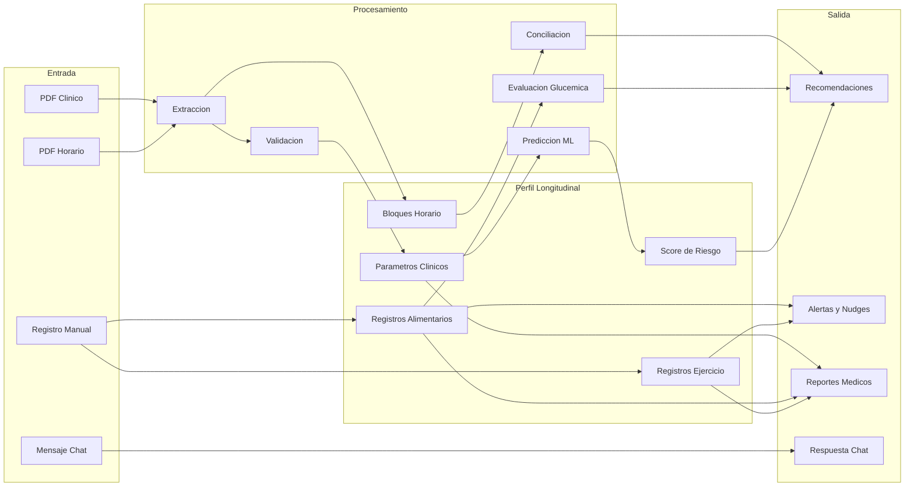

# Arquitectura del Sistema -- AlToque AI

## Vista General

AlToque AI se estructura en 7 dominios tecnicos independientes que interactuan a traves de una capa de API REST versionada. Cada dominio encapsula su logica de negocio, modelos de datos y endpoints.

## Diagrama de Arquitectura

```mermaid
graph TB
    subgraph "Canales de Entrada"
        APP["App Mobile - Flutter"]
        WA["WhatsApp Business API"]
        PDF_UP["Upload PDF / Imagen"]
    end

    subgraph "API Gateway - FastAPI v1"
        API["REST API v1"]
        AUTH["Auth Middleware - JWT"]
        RBAC["Role-Based Access Control"]
    end

    subgraph "Dominio: Ingestion"
        direction TB
        OCR["OCR Engine"]
        LLM_EXT["LLM Structured Extraction"]
        SCHEMA_VAL["JSON Schema Validator"]
        CLIN_PARSER["Clinical Parameter Parser"]
        SCHED_PARSER["Schedule Block Parser"]
    end

    subgraph "Dominio: Scheduling"
        direction TB
        SCHED_ENGINE["Schedule Conciliation Engine"]
        META_WIN["Metabolic Windows Calculator"]
        SLEEP["Sleep Target Manager"]
    end

    subgraph "Dominio: Glycemic Engine"
        direction TB
        BUFFER["Glycemic Buffer Analyzer"]
        SIMULATOR["Glucose Response Simulator"]
        FOOD_ORDER["Food Order Tracker"]
    end

    subgraph "Dominio: Physical"
        direction TB
        MUSCLE_SINK["Post-Meal Muscle Sink Trigger"]
        STRENGTH["Strength Planner"]
        EX_LOG["Exercise Logger"]
    end

    subgraph "Dominio: Profiles and Care Network"
        direction TB
        PROF_MGR["Dual Profile Manager"]
        PAIRING["Patient-Caregiver Pairing"]
        NUDGE["Automated Nudge Engine"]
    end

    subgraph "Dominio: Assistant"
        direction TB
        CHAT["Chat Orchestrator"]
        RAG["RAG Context Builder"]
        LLM_CHAT["LLM with Function Calling"]
        TOOL_EXEC["Tool Executor"]
    end

    subgraph "Dominio: Reporting"
        direction TB
        ADHERENCE["Adherence Calculator"]
        PDF_GEN["PDF Report Generator"]
    end

    subgraph "ML Pipeline"
        direction TB
        FEAT_ENG["Feature Engineering"]
        XGBOOST["XGBoost Risk Model"]
        SHAP_EXP["SHAP Explainability"]
        RISK_PROF["Dynamic Risk Profile"]
    end

    subgraph "Data Layer"
        PG[("PostgreSQL 16 + pgvector")]
        REDIS[("Redis 7")]
    end

    APP --> API
    WA --> API
    PDF_UP --> API
    API --> AUTH --> RBAC

    RBAC --> OCR
    OCR --> LLM_EXT
    LLM_EXT --> SCHEMA_VAL
    SCHEMA_VAL --> CLIN_PARSER
    SCHEMA_VAL --> SCHED_PARSER

    RBAC --> SCHED_ENGINE
    SCHED_ENGINE --> META_WIN
    SLEEP --> SCHED_ENGINE

    RBAC --> BUFFER
    RBAC --> SIMULATOR
    RBAC --> FOOD_ORDER

    RBAC --> MUSCLE_SINK
    RBAC --> STRENGTH
    RBAC --> EX_LOG

    RBAC --> PROF_MGR
    RBAC --> PAIRING
    RBAC --> NUDGE

    RBAC --> CHAT
    CHAT --> RAG
    RAG --> LLM_CHAT
    LLM_CHAT --> TOOL_EXEC

    RBAC --> ADHERENCE
    ADHERENCE --> PDF_GEN

    CLIN_PARSER --> PG
    SCHED_PARSER --> PG
    META_WIN --> PG
    BUFFER --> PG
    FOOD_ORDER --> PG
    EX_LOG --> PG
    PROF_MGR --> PG
    NUDGE --> PG
    CHAT --> PG
    ADHERENCE --> PG
    RISK_PROF --> PG

    FEAT_ENG --> XGBOOST
    XGBOOST --> SHAP_EXP
    SHAP_EXP --> RISK_PROF

    REDIS -.-> API
    REDIS -.-> CHAT

    NUDGE --> WA
    TOOL_EXEC --> BUFFER
    TOOL_EXEC --> META_WIN
    TOOL_EXEC --> RISK_PROF
```

## Diagrama de Flujo de Datos

## Principios de Diseno

1. **Perfil progresivo**: La ausencia de un dato no bloquea la plataforma. El sistema adapta el nivel de personalizacion a la informacion disponible.

2. **Separacion IA/ML**: El LLM orquesta la conversacion y extrae datos. El modelo ML predice el riesgo. Son pipelines independientes.

3. **Modularidad por dominio**: Cada dominio tiene modelos, schemas, servicios y endpoints aislados. Permite desarrollo paralelo y testing independiente.

4. **API-first**: Toda la funcionalidad se expone via REST API versionada. Los canales (app, WhatsApp) son consumidores del mismo backend.

5. **Auditabilidad**: Cada extraccion, prediccion y recomendacion queda registrada con su contexto para trazabilidad clinica.
