# Esquema de Base de Datos -- AlToque AI

## Diagrama Entidad-Relacion

```mermaid
erDiagram
    users ||--o{ patient_profiles : "has"
    users ||--o{ user_pairings : "patient"
    users ||--o{ user_pairings : "caregiver"
    users ||--o{ uploaded_documents : "uploads"
    users ||--o{ chat_sessions : "initiates"
    users ||--o{ medical_reports : "generates"
    users ||--o{ risk_assessments : "evaluated"
    users ||--o{ schedule_blocks : "has"
    users ||--o{ metabolic_windows : "calculated"
    users ||--o{ sleep_targets : "defines"
    users ||--o{ food_logs : "registers"
    users ||--o{ exercise_triggers : "receives"
    users ||--o{ strength_plans : "assigned"
    users ||--o{ exercise_logs : "completes"

    uploaded_documents ||--o{ clinical_records : "produces"
    uploaded_documents ||--o{ schedule_blocks : "produces"

    clinical_records ||--o{ clinical_parameters : "contains"

    food_logs ||--o{ food_items : "contains"
    food_logs ||--o| buffer_evaluations : "evaluated_by"
    food_logs ||--o| glucose_simulations : "simulated_by"
    food_logs ||--o{ exercise_triggers : "triggers"

    strength_plans ||--o{ exercise_logs : "tracked_by"
    exercise_triggers ||--o{ exercise_logs : "completed_as"

    chat_sessions ||--o{ chat_messages : "contains"

    users ||--o{ nudge_events : "patient_receives"
    users ||--o{ nudge_events : "caregiver_sends"

    users {
        uuid id PK
        string email UK
        string phone UK
        string hashed_password
        enum role "patient | caregiver | doctor"
        boolean is_active
        timestamp created_at
        timestamp updated_at
    }

    patient_profiles {
        uuid id PK
        uuid user_id FK
        date birth_date
        enum sex "male | female"
        float height_cm
        float weight_kg
        enum activity_level "sedentary | light | moderate | active"
        float profile_completeness_pct
        timestamp created_at
        timestamp updated_at
    }

    user_pairings {
        uuid id PK
        uuid patient_id FK
        uuid caregiver_id FK
        enum status "pending | active | revoked"
        json permissions
        timestamp created_at
    }

    uploaded_documents {
        uuid id PK
        uuid user_id FK
        enum doc_type "clinical | schedule"
        string file_url
        string mime_type
        string original_filename
        enum status "pending | processing | processed | failed"
        text error_detail
        timestamp uploaded_at
        timestamp processed_at
    }

    clinical_records {
        uuid id PK
        uuid document_id FK
        uuid user_id FK
        date lab_date
        enum source "ocr | manual"
        json raw_extraction
        boolean validated
        timestamp created_at
    }

    clinical_parameters {
        uuid id PK
        uuid record_id FK
        string parameter_name
        float value
        string unit
        float ref_range_low
        float ref_range_high
        enum flag "normal | high | low | critical"
    }

    schedule_blocks {
        uuid id PK
        uuid user_id FK
        uuid document_id FK
        integer day_of_week
        time start_time
        time end_time
        enum block_type "work | sleep | fixed | commute"
        string label
    }

    metabolic_windows {
        uuid id PK
        uuid user_id FK
        enum window_type "breakfast | lunch | dinner | snack | micro_exercise"
        time optimal_start
        time optimal_end
        integer day_of_week
        timestamp generated_at
    }

    sleep_targets {
        uuid id PK
        uuid user_id FK
        float target_hours
        time bedtime_target
        time wakeup_target
        timestamp updated_at
    }

    food_logs {
        uuid id PK
        uuid user_id FK
        enum meal_type "breakfast | lunch | dinner | snack"
        uuid window_id FK
        boolean order_confirmed
        timestamp logged_at
    }

    food_items {
        uuid id PK
        uuid food_log_id FK
        string name
        enum category "carbohydrate | protein | fat | fiber | mixed"
        float gi_estimate
        integer order_position
        string notes
    }

    buffer_evaluations {
        uuid id PK
        uuid food_log_id FK
        boolean has_buffer
        float buffer_score
        enum alert_type "isolated_carb | partial_buffer | synergy_ok | acid_boost"
        text recommendation_text
        timestamp evaluated_at
    }

    glucose_simulations {
        uuid id PK
        uuid food_log_id FK
        json curve_isolated
        json curve_buffered
        float peak_reduction_pct
        timestamp simulated_at
    }

    exercise_triggers {
        uuid id PK
        uuid user_id FK
        uuid food_log_id FK
        timestamp trigger_at
        timestamp notified_at
        boolean completed
        string exercise_type
        integer duration_min
    }

    strength_plans {
        uuid id PK
        uuid user_id FK
        enum plan_variant "standard | senior"
        enum focus_area "lower_body | back | full"
        json exercises
        integer week_number
        timestamp created_at
    }

    exercise_logs {
        uuid id PK
        uuid user_id FK
        uuid plan_id FK
        uuid trigger_id FK
        timestamp completed_at
        integer duration_min
        text notes
    }

    nudge_events {
        uuid id PK
        uuid patient_id FK
        uuid caregiver_id FK
        enum trigger_reason "missed_meal | missed_exercise | missed_medication"
        timestamp missed_block_time
        timestamp nudge_sent_at
        enum channel "whatsapp | push"
        boolean caregiver_responded
        timestamp responded_at
    }

    chat_sessions {
        uuid id PK
        uuid user_id FK
        enum channel "app | whatsapp"
        timestamp started_at
        timestamp last_message_at
    }

    chat_messages {
        uuid id PK
        uuid session_id FK
        enum role "user | assistant | system | tool"
        text content
        json tool_calls
        json context_snapshot
        timestamp created_at
    }

    medical_reports {
        uuid id PK
        uuid user_id FK
        timestamp generated_at
        date period_start
        date period_end
        float adherence_food_order_pct
        float adherence_sleep_pct
        float adherence_exercise_pct
        string report_pdf_url
    }

    risk_assessments {
        uuid id PK
        uuid user_id FK
        timestamp assessed_at
        float risk_score
        enum risk_level "low | moderate | high | critical"
        string model_version
        json features_used
        json shap_values
    }
```

## Notas de Diseno

1. **UUIDs como claves primarias**: Seguridad y compatibilidad con sistemas distribuidos.

2. **Campos JSON**: Se utilizan para datos semi-estructurados (permisos, ejercicios, curvas de simulacion, valores SHAP). PostgreSQL soporta indexacion y consultas sobre JSONB.

3. **Enumeraciones**: Implementadas como tipos enum de PostgreSQL para integridad de datos.

4. **Soft deletes**: No implementados en el MVP. Se evalua para fases posteriores.

5. **pgvector**: La extension pgvector se utiliza en la tabla `chat_messages` y en tablas auxiliares de embeddings para el componente RAG del chatbot contextualizado.

6. **Indices recomendados**:
   - `users(email)`, `users(phone)` -- unicidad y busqueda
   - `clinical_parameters(record_id, parameter_name)` -- consulta por parametro
   - `food_logs(user_id, logged_at)` -- consulta temporal
   - `metabolic_windows(user_id, day_of_week)` -- consulta por dia
   - `risk_assessments(user_id, assessed_at)` -- historial de riesgo
