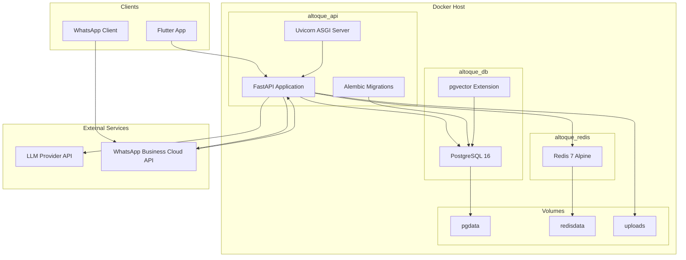
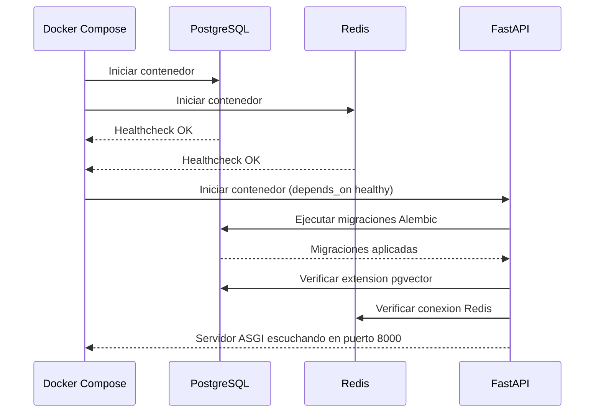

# Diagrama de Despliegue -- AlToque AI

## Arquitectura de Despliegue Local (Docker Compose)

## Servicios Docker Compose

| Servicio | Imagen | Puerto | Healthcheck |
|----------|--------|--------|-------------|
| db | pgvector/pgvector:pg16 | 5432 | pg_isready |
| redis | redis:7-alpine | 6379 | redis-cli ping |
| api | Build desde backend/Dockerfile | 8000 | HTTP /health |

## Variables de Entorno Requeridas

| Variable | Servicio | Descripcion |
|----------|----------|-------------|
| DATABASE_URL | api | Connection string PostgreSQL (asyncpg) |
| REDIS_URL | api | Connection string Redis |
| SECRET_KEY | api | Clave para firma de JWT |
| LLM_PROVIDER | api | Proveedor LLM (openai, gemini, anthropic) |
| LLM_API_KEY | api | API key del proveedor LLM |
| LLM_MODEL | api | Modelo LLM a utilizar |
| WHATSAPP_ACCESS_TOKEN | api | Token de WhatsApp Business API |
| WHATSAPP_PHONE_NUMBER_ID | api | ID del numero de WhatsApp |
| WHATSAPP_VERIFY_TOKEN | api | Token de verificacion del webhook |
| POSTGRES_USER | db | Usuario de PostgreSQL |
| POSTGRES_PASSWORD | db | Contrasena de PostgreSQL |
| POSTGRES_DB | db | Nombre de la base de datos |

## Flujo de Inicializacion

## Consideraciones de Produccion

Para un despliegue en produccion se requiere:

1. **Reverse proxy**: Nginx o Traefik delante de Uvicorn para terminacion SSL.
2. **Workers**: Configurar multiples workers de Uvicorn (2 * CPU cores + 1).
3. **Backups**: Backup automatizado de PostgreSQL (pg_dump o WAL archiving).
4. **Secrets management**: Vault, AWS Secrets Manager o equivalente en lugar de archivo .env.
5. **Logging**: Salida estructurada JSON hacia un agregador (ELK, CloudWatch, Datadog).
6. **Monitoring**: Metricas de Prometheus + Grafana para latencia, errores y uso de recursos.
7. **CI/CD**: Pipeline de build, test y deploy automatizado.
