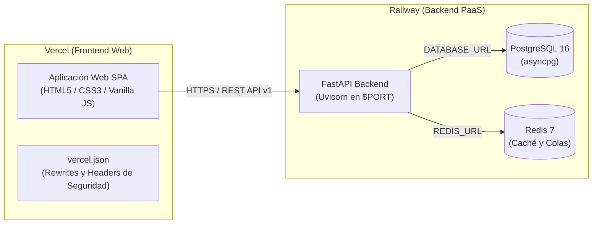
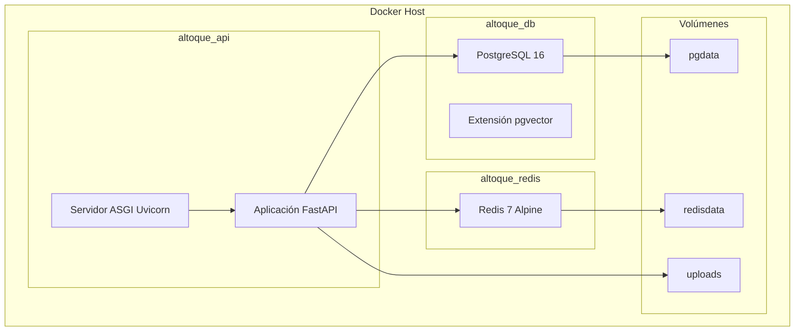

# Guía de Despliegue -- AlToque AI

## Arquitectura de Despliegue en Producción (Railway + Vercel)



---

## 1. Despliegue del Backend en Railway

### Requisitos Previos

- Cuenta activa en [Railway](https://railway.app)
- Repositorio del proyecto subido a GitHub o GitLab

### Pasos

1. **Crear un nuevo proyecto en Railway** y conectar el repositorio Git.
2. **Añadir el servicio PostgreSQL** desde el panel de Railway (Add Plugin > PostgreSQL).
3. **Añadir el servicio Redis** desde el panel de Railway (Add Plugin > Redis).
4. **Configurar las variables de entorno** en la pestaña Variables del servicio principal:

| Variable | Valor | Notas |
|----------|-------|-------|
| `DATABASE_URL` | Autogenerada por Railway | Se normaliza automáticamente en `config.py` |
| `REDIS_URL` | Autogenerada por Railway | |
| `SECRET_KEY` | Cadena aleatoria segura (mín. 32 caracteres) | |
| `LLM_PROVIDER` | `openai`, `gemini` o `anthropic` | |
| `LLM_API_KEY` | Clave API del proveedor LLM | |
| `LLM_MODEL` | `gpt-4o` u otro modelo compatible | |
| `WHATSAPP_ACCESS_TOKEN` | Token de la API de WhatsApp Business | Solo si se usa integración WhatsApp |
| `WHATSAPP_PHONE_NUMBER_ID` | ID del número de WhatsApp | Solo si se usa integración WhatsApp |
| `WHATSAPP_VERIFY_TOKEN` | Token de verificación del webhook | Solo si se usa integración WhatsApp |
| `DEBUG` | `false` | Deshabilita Swagger UI en producción |
| `PORT` | Inyectado automáticamente por Railway | No definir manualmente |

5. **Railway detectará** el archivo `railway.json` en la raíz y usará el `Dockerfile` del directorio `backend/` para construir la imagen.
6. **El healthcheck** se ejecutará en `/health` automáticamente.
7. **Verificar el despliegue** accediendo a `https://<su-servicio>.up.railway.app/health`.

### Consideraciones Técnicas de Railway

- Railway provisiona PostgreSQL con URLs que inician con `postgres://` o `postgresql://`. El archivo `config.py` normaliza automáticamente el prefijo a `postgresql+asyncpg://`.
- El puerto es dinámico (`$PORT`). El `Dockerfile` usa `${PORT:-8000}` para compatibilidad.
- La política de reinicio está configurada como `ON_FAILURE` con máximo 5 reintentos.

---

## 2. Despliegue del Frontend en Vercel

### Requisitos Previos

- Cuenta activa en [Vercel](https://vercel.com)
- Repositorio del proyecto subido a GitHub

### Pasos

1. **Importar el repositorio** en Vercel desde el panel de control.
2. **Configurar el proyecto** con estos parámetros:
   - **Framework Preset:** Other
   - **Root Directory:** (raíz del repositorio)
   - **Output Directory:** `frontend` (definido en `vercel.json`)
   - **Build Command:** Dejar vacío (archivos estáticos sin compilación)
3. **Hacer clic en Deploy.**
4. **Configurar la URL del backend** desde la interfaz web haciendo clic en el icono de engranaje de la barra de navegación e ingresando la URL pública de Railway.

### Configuración de CORS

El backend ya incluye `allow_origin_regex=r"https://.*\.vercel\.app"` en la configuración de CORS, por lo que cualquier despliegue en Vercel (producción y previews) tiene acceso autorizado a la API.

### Headers de Seguridad

El archivo `vercel.json` configura automáticamente:
- `X-Content-Type-Options: nosniff`
- `X-Frame-Options: DENY`
- `X-XSS-Protection: 1; mode=block`

---

## 3. Despliegue Local con Docker Compose



### Servicios Docker Compose

| Servicio | Imagen | Puerto | Healthcheck |
|----------|--------|--------|-------------|
| db | pgvector/pgvector:pg16 | 5432 | pg_isready |
| redis | redis:7-alpine | 6379 | redis-cli ping |
| api | Build desde backend/Dockerfile | 8000 | HTTP /health |

### Comandos

```bash
# Iniciar todos los servicios
docker compose up -d

# Verificar estado
docker compose ps

# Ver registros del backend
docker compose logs -f api

# Detener servicios
docker compose down
```

---

## 4. Variables de Entorno (Referencia Completa)

| Variable | Servicio | Descripción |
|----------|----------|-------------|
| `DATABASE_URL` | Backend | Cadena de conexión PostgreSQL (asyncpg) |
| `REDIS_URL` | Backend | Cadena de conexión Redis |
| `SECRET_KEY` | Backend | Clave para firma de JWT |
| `LLM_PROVIDER` | Backend | Proveedor LLM (openai, gemini, anthropic) |
| `LLM_API_KEY` | Backend | Clave API del proveedor LLM |
| `LLM_MODEL` | Backend | Modelo LLM a utilizar |
| `WHATSAPP_ACCESS_TOKEN` | Backend | Token de API de WhatsApp Business |
| `WHATSAPP_PHONE_NUMBER_ID` | Backend | ID del número de WhatsApp |
| `WHATSAPP_VERIFY_TOKEN` | Backend | Token de verificación del webhook |
| `PORT` | Backend | Puerto del servidor (inyectado por Railway) |
| `DEBUG` | Backend | Habilita Swagger UI y modo depuración |
| `CORS_ORIGINS` | Backend | Lista JSON de orígenes permitidos |
| `POSTGRES_USER` | Base de datos | Usuario de PostgreSQL |
| `POSTGRES_PASSWORD` | Base de datos | Contraseña de PostgreSQL |
| `POSTGRES_DB` | Base de datos | Nombre de la base de datos |

---

## 5. Consideraciones de Producción

1. **HTTPS:** Railway y Vercel proporcionan certificados SSL automáticamente.
2. **Workers:** Para alta concurrencia, configurar múltiples workers de Uvicorn (2 * núcleos CPU + 1).
3. **Respaldos:** Activar respaldo automático de PostgreSQL desde el panel de Railway.
4. **Secretos:** Usar las variables de entorno de Railway en lugar de archivos `.env`.
5. **Registros:** Salida estructurada JSON hacia un agregador (Datadog, CloudWatch).
6. **Monitoreo:** Configurar alertas de healthcheck en Railway.
7. **CI/CD:** Railway despliega automáticamente cada push a la rama principal.

