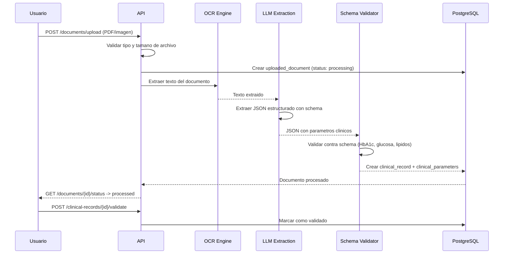
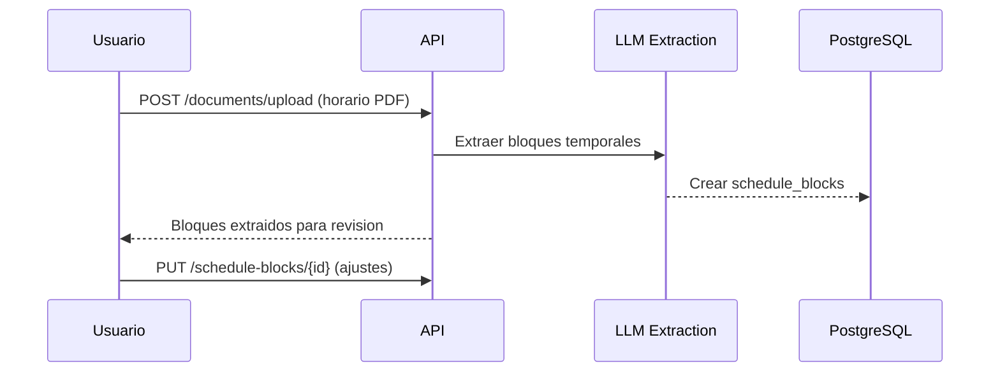
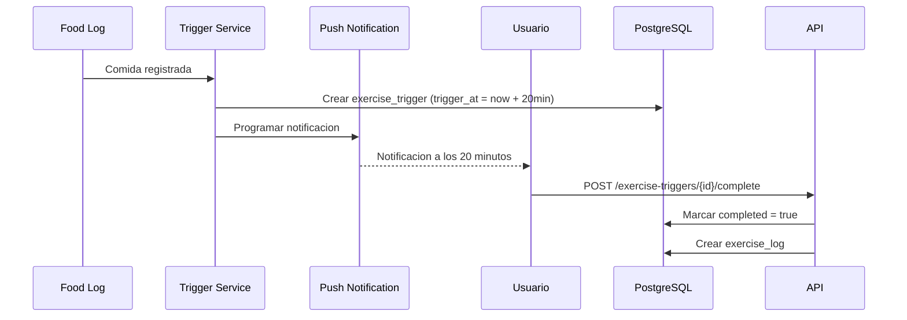

# Catalogo de Funcionalidades -- AlToque AI

## Resumen

12 funcionalidades organizadas en 5 dominios. Cada feature incluye descripcion tecnica, flujo de datos y dependencias.

---

## Dominio 1: Ingesta y Extraccion Inteligente de Datos

### F-01: Medical PDF Parser

**Objetivo**: Automatizar la captura de marcadores metabolicos desde documentos clinicos.

**Flujo**:


**Parametros extraidos**: HbA1c, glucosa en ayunas, colesterol total, HDL, LDL, trigliceridos, insulina basal.

**Schema de extraccion JSON**:
```json
{
  "lab_date": "2026-01-15",
  "parameters": [
    {"name": "hba1c", "value": 6.1, "unit": "%", "ref_low": 4.0, "ref_high": 5.6},
    {"name": "fasting_glucose", "value": 112, "unit": "mg/dL", "ref_low": 70, "ref_high": 99}
  ]
}
```

---

### F-02: Schedule PDF Ingestion

**Objetivo**: Extraer bloques temporales de indisponibilidad y rutinas fijas desde cronogramas.

**Flujo**:


**Datos extraidos**: Hora de despertar, bloques de trabajo, hora de acostarse, actividades fijas recurrentes.

---

### F-03: Motor de Conciliacion de Horarios y Ventanas Metabolicas

**Objetivo**: Calcular ventanas optimas para comidas y actividad fisica sin colision con obligaciones.

**Algoritmo**:
1. Obtener todos los schedule_blocks del usuario para cada dia de la semana.
2. Obtener sleep_targets (hora de dormir, hora de despertar).
3. Identificar gaps libres entre bloques.
4. Asignar ventanas metabolicas:
   - Desayuno: 30-60 minutos post-despertar.
   - Almuerzo: gap mas cercano a las 6 horas post-desayuno.
   - Cena: al menos 2-3 horas antes de la hora de dormir.
   - Micro-ejercicio: 15-30 minutos post cada comida principal.
5. Validar que ninguna ventana colisione con bloques fijos.
6. Almacenar en metabolic_windows.

**Dependencias**: F-02 (schedule_blocks), sleep_targets.

---

## Dominio 2: Motor de Dinamica Glucemica

### F-04: Glycemic Buffer Engine

**Objetivo**: Evaluar el impacto de combinaciones de macronutrientes en la respuesta glucemica.

**Reglas heuristicas**:

| Condicion | Score | Alerta |
|-----------|-------|--------|
| Carbohidrato aislado sin acompanamiento | 10 | isolated_carb |
| Carbohidrato + fibra viscosa | +25 | -- |
| Carbohidrato + proteina magra | +25 | -- |
| Carbohidrato + grasa monoinsaturada | +20 | -- |
| Orden confirmado (fibra primero) | +20 | -- |
| Acido acetico presente | +10 | acid_boost |

**Clasificacion del score**:
- 0-30: Alerta roja (carbohidrato aislado, sin buffer)
- 31-60: Alerta amarilla (buffer parcial)
- 61-90: Verde (sinergia adecuada)
- 91-100: Verde con boost (sinergia + acido acetico)

---

### F-05: Simulador Visual de Respuesta Glucemica Estimada

**Objetivo**: Mostrar graficamente la diferencia entre consumir un carbohidrato solo versus con buffer.

**Curvas generadas**:
- Curva A (aislada): Pico abrupto a los 30-45 min, retorno a baseline a los 120 min.
- Curva B (amortiguada): Pico reducido 30-50%, tiempo al pico extendido, retorno gradual.

**Modelo**: Basado en modelo de Lehmann-Deutsch simplificado, parametrizado por indice glucemico y presencia de buffer.

**Output**: JSON con array de puntos `{time_min, glucose_mg_dl}` para ambas curvas.

---

### F-06: Smart Food Order Tracker

**Objetivo**: Interfaz de confirmacion de secuencia de ingesta optima.

**Secuencia recomendada**:
1. Vegetales y fibra (primera capa gastrica)
2. Proteinas y grasas
3. Carbohidratos y almidones

**Mecanismo**: Interfaz one-tap donde el usuario confirma el orden antes o durante la comida. El campo `order_confirmed` se registra en food_logs.

---

## Dominio 3: Habitos Fisicos y Captacion de Glucosa

### F-07: Muscle Sink Trigger

**Objetivo**: Activar receptores GLUT4 independientes de insulina mediante contracciones musculares post-comida.

**Flujo**:


**Acciones guiadas**: Caminata ligera (5-10 min), elevaciones de soleo sentado, sentadillas controladas.

---

### F-08: Planificador de Fuerza e Hipertrofia Funcional

**Objetivo**: Rutinas de resistencia progresiva orientadas a los mayores reservorios de glucogeno.

**Variantes**:
- Estandar: Sentadillas, peso muerto, remo, press de piernas.
- Senior: Sentadillas asistidas, press de piernas con maquina, caminar con carga ligera.

**Parametros**: 15-20 minutos, 3-4 ejercicios, 2-3 series de 8-12 repeticiones, foco en tren inferior y espalda.

---

## Dominio 4: Perfiles y Red de Cuidado

### F-09: Perfil Dual Paciente-Cuidador

**Roles**:
- **Paciente**: Interfaz minimalista, botones grandes, confirmacion de ingesta, recordatorios sonoros.
- **Cuidador**: Monitorizacion remota de registros, porcentaje de adherencia, estado de rutinas.
- **Medico**: Acceso a reportes generados (F-12), historial clinico.

**Permisos por pairing**: view_food_logs, view_clinical, view_exercise, send_nudge, view_reports.

---

### F-10: Nudge Humano Automatizado

**Objetivo**: Involucrar al cuidador cuando el paciente omite una accion programada.

**Logica de deteccion**:
1. metabolic_window pasa su optimal_end.
2. Esperar 45 minutos adicionales.
3. Verificar si existe food_log o exercise_log correspondiente.
4. Si no existe: generar nudge_event y enviar alerta al cuidador.
5. El cuidador responde con un boton (one-tap) que envia recordatorio al paciente.

**Canales de nudge**: WhatsApp (via Business API) o notificacion push.

---

## Dominio 5: Asistente Conversacional y Auditoria

### F-11: Chatbot Contextualizado

**Objetivo**: Asistente que responde con contexto real del paciente, no de forma generica.

**Contexto inyectado al LLM**:
- Parametros clinicos mas recientes (F-01)
- Horarios fijos y ventanas metabolicas (F-02, F-03)
- Ultimo food_log y evaluacion de buffer (F-04, F-06)
- Triggers pendientes o completados (F-07)
- Score de riesgo actual (ML)

**Tools disponibles para Function Calling**:
- `get_metabolic_windows()`: Consultar proxima ventana
- `log_food()`: Registrar comida via chat
- `get_buffer_evaluation()`: Evaluar combinacion de alimentos
- `get_risk_score()`: Consultar riesgo actual
- `get_exercise_trigger()`: Consultar triggers pendientes

**Ejemplo de respuesta contextualizada**:
"Segun tu horario, hoy entras a reunion a las 3:00 PM. Te quedan 20 minutos para las 10 sentadillas post-almuerzo. Si las haces ahora, llegas con margen."

---

### F-12: Medical Report Generator

**Objetivo**: Generar reporte PDF para el medico tratante con metricas de adherencia.

**Contenido del reporte**:
- Periodo evaluado
- Tasa de cumplimiento del orden alimentario (food_logs con order_confirmed / total)
- Registro de descanso (adherencia a sleep_targets de 6-8 horas)
- Frecuencia de micro-ejercicios musculares (exercise_triggers completados / total)
- Evolucion del risk_score
- Parametros clinicos mas recientes
- Valores SHAP principales (factores de riesgo dominantes)
