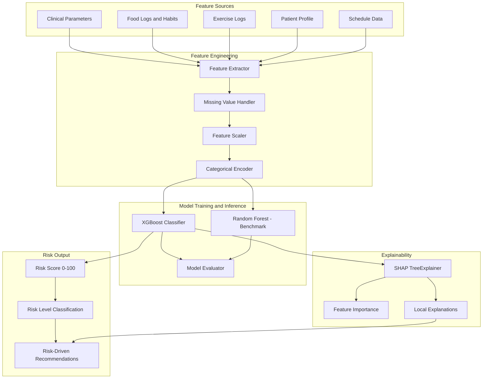

# Pipeline de Machine Learning -- AlToque AI

## Arquitectura del Pipeline



## Features de Entrada

### Parametros Clinicos (F-01)

| Feature | Tipo | Unidad | Descripcion |
|---------|------|--------|-------------|
| hba1c | float | % | Hemoglobina glicosilada |
| fasting_glucose | float | mg/dL | Glucosa en ayunas |
| total_cholesterol | float | mg/dL | Colesterol total |
| hdl_cholesterol | float | mg/dL | Colesterol HDL |
| ldl_cholesterol | float | mg/dL | Colesterol LDL |
| triglycerides | float | mg/dL | Trigliceridos |
| fasting_insulin | float | uIU/mL | Insulina basal |
| homa_ir | float | -- | Indice HOMA-IR (calculado) |

### Perfil del Paciente (F-09)

| Feature | Tipo | Descripcion |
|---------|------|-------------|
| age | int | Edad en anos |
| sex | binary | Sexo biologico |
| bmi | float | Indice de masa corporal (calculado) |
| activity_level | ordinal | Nivel de actividad fisica |

### Habitos Alimentarios (F-04, F-06)

| Feature | Tipo | Descripcion |
|---------|------|-------------|
| avg_buffer_score_7d | float | Score promedio del buffer glucemico (ultimos 7 dias) |
| pct_order_confirmed_7d | float | Porcentaje de comidas con orden confirmado |
| avg_gi_intake_7d | float | Indice glucemico promedio de ingesta |
| meals_with_fiber_pct | float | Porcentaje de comidas con fibra como primer item |

### Actividad Fisica (F-07, F-08)

| Feature | Tipo | Descripcion |
|---------|------|-------------|
| exercise_triggers_completed_7d | int | Triggers post-comida completados |
| strength_sessions_7d | int | Sesiones de fuerza completadas |
| avg_exercise_duration_min | float | Duracion promedio de ejercicio |
| pct_triggers_completed | float | Porcentaje de triggers completados |

### Adherencia General

| Feature | Tipo | Descripcion |
|---------|------|-------------|
| profile_completeness | float | Porcentaje de completitud del perfil |
| days_active | int | Dias desde el registro |
| sleep_target_adherence_7d | float | Adherencia a meta de sueno |

## Preprocesamiento

1. **Valores faltantes**: El sistema opera con perfil progresivo. Los features ausentes se manejan con:
   - Imputacion por mediana para parametros clinicos.
   - Valor por defecto (0) para features de adherencia si el usuario aun no tiene registros.
   - Indicador binario `_is_missing` para cada feature faltante.

2. **Escalado**: StandardScaler para features continuos. No se aplica para XGBoost (invariante a escala) pero se mantiene para el benchmark de Random Forest.

3. **Codificacion**: OneHotEncoder para variables categoricas (sex, activity_level).

## Modelos

### XGBoost (modelo principal)

- Objetivo: Clasificacion binaria de riesgo de progresion a diabetes tipo 2.
- Hiperparametros iniciales: max_depth=6, learning_rate=0.1, n_estimators=200, scale_pos_weight ajustado al desbalance.
- Regularizacion: L1 (reg_alpha) y L2 (reg_lambda) para evitar sobreajuste con datasets pequenos.

### Random Forest (benchmark)

- Mismo objetivo de clasificacion.
- n_estimators=200, max_depth=10.
- Se utiliza exclusivamente para comparacion de metricas.

## Evaluacion

| Metrica | Descripcion |
|---------|-------------|
| AUC-ROC | Area bajo la curva ROC |
| Precision | Proporcion de positivos correctos |
| Recall | Proporcion de positivos detectados |
| F1-Score | Media armonica de precision y recall |
| Brier Score | Calibracion de probabilidades |

## Explicabilidad con SHAP

- **TreeExplainer** para XGBoost: complejidad O(TLD) donde T=arboles, L=hojas, D=profundidad.
- **Global**: Feature importance por valor SHAP absoluto medio.
- **Local**: Valores SHAP por prediccion individual almacenados en `risk_assessments.shap_values`.
- **Interpretacion para el usuario**: Los valores SHAP se traducen a texto comprensible. Ejemplo: "Tu nivel de HbA1c (6.2%) es el factor que mas contribuye a tu nivel de riesgo actual."

## Motor Glucemico (F-04)

El Glycemic Buffer Engine no utiliza ML. Opera con reglas heuristicas basadas en evidencia clinica:

```
score = 0

if meal has isolated_carbohydrate and no buffer:
    score = 10
    alert = "isolated_carb"

if meal has carb + fiber:
    score += 25
if meal has carb + protein:
    score += 25
if meal has carb + healthy_fat:
    score += 20
if order_confirmed and fiber_first:
    score += 20
if has_acetic_acid:
    score += 10

alert = classify(score)
    0-30  -> "isolated_carb"
    31-60 -> "partial_buffer"
    61-90 -> "synergy_ok"
    91-100 -> "acid_boost"
```

## Simulador de Curva Glucemica (F-05)

Modelo matematico simplificado basado en el modelo de Lehmann-Deutsch para absorcion de glucosa oral:

- **Curva aislada**: Pico a los 30-45 minutos, retorno a baseline a los 120 minutos.
- **Curva amortiguada**: Pico reducido 30-50%, tiempo al pico extendido a 60-90 minutos, retorno gradual.
- Parametros de ajuste: indice glucemico del alimento, presencia de fibra viscosa, proteina y grasa, orden de ingesta.
- Output: Array de puntos `{time_min, glucose_mg_dl}` para renderizado en frontend.
